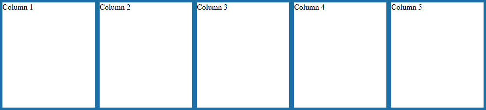
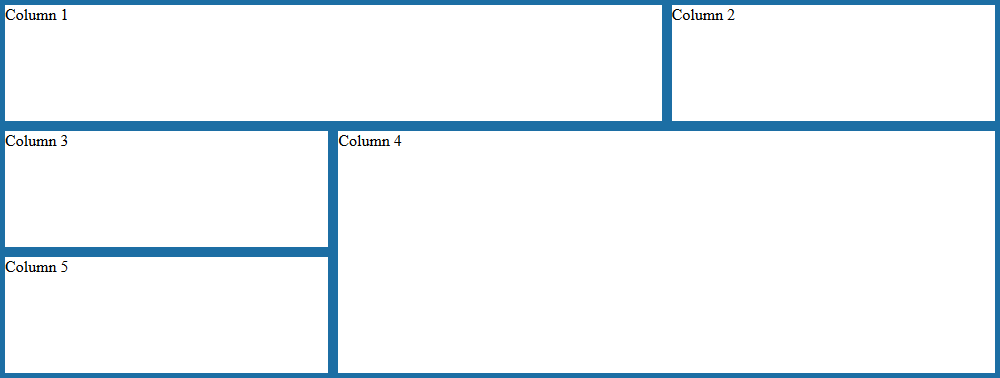

# grillade

> Grid sytem for [shiny](https://github.com/rstudio/shiny) apps or [rmarkdown](https://github.com/rstudio/rmarkdown) document, mainly to create [htmlwidgets](https://github.com/ramnathv/htmlwidgets) matrix. R interface for grillade from [KNACSS](https://github.com/alsacreations/KNACSS).

<!-- badges: start -->
[](https://www.tidyverse.org/lifecycle/#experimental)
[](https://github.com/dreamRs/grillade/actions)
<!-- badges: end -->


## Installation

You can install the development version of grillade from GitHub with:

``` r
remotes::install_github("dreamRs/grillade")
```

## Examples

The main function `grillade()`  can be used in three different ways :

* in RStudio's Viewer to display {htmlwidgets} matrix
* in {shiny}, both in the UI or in the server
* in {rmarkdown} document

The default behavior is to create as many columns as elements of the `grillade()` :

```r
library(grillade)

# For example, use a div with borders
box_example <- function(...) {
  tags$div(
    style = "box-sizing:border-box;border:5px solid #1C6EA4;height:100%;",
    ...
  )
}

# Construct the grid
grillade(
  box_example("Column 1"),
  box_example("Column 2"),
  box_example("Column 3"),
  box_example("Column 4"),
  box_example("Column 5")
)
```




You can customize the grid by providing number of columns, and specifying widths and heights of elements with `knack()`:

```r
grillade(
  n_col = 3,
  knack(
    cols = 2,
    box_example("Column 1")
  ),
  box_example("Column 2"),
  box_example("Column 3"),
  knack(
    cols = 2,
    rows = 2,
    box_example("Column 4")
  ),
  box_example("Column 5")
)
```



## Related packages

These packages provide similar functionality, check them out:

* [cssgrid](https://github.com/atusy/cssgrid): CSS Grid Layout for R Markdown and Shiny
* [manipulateWidgets](https://github.com/rte-antares-rpackage/manipulateWidget): Add More Interactivity to htmlwidgets


