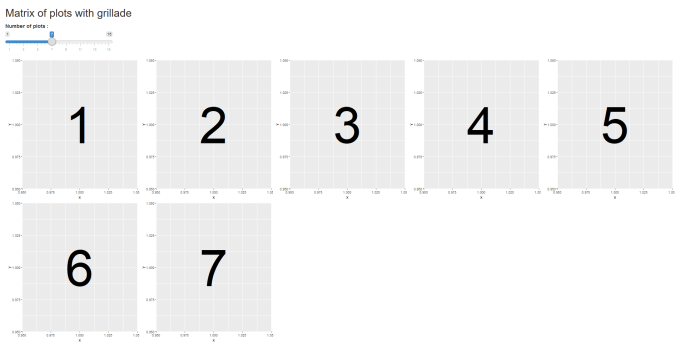

```{r, include = FALSE}
knitr::opts_chunk$set(
  collapse = TRUE,
  comment = "#>", 
  eval = FALSE
)
```

```{r setup}
library(grillade)
```


## UI

You can use `grillade()` in shiny's UI with other normal UI component:

```{r}
library(grillade)
library(shiny)
library(ggplot2)

ui <- fluidPage(
  
  tags$b("3 columns"),
  grillade(
    wellPanel("Column 1", style = "text-align: center;"),
    wellPanel("Column 2", style = "text-align: center;"),
    wellPanel("Column 3", style = "text-align: center;")
  ),
  
  tags$b("5 columns with gutter"),
  grillade(
    gutter = TRUE,
    wellPanel("Column 1", style = "text-align: center;"),
    wellPanel("Column 2", style = "text-align: center;"),
    wellPanel("Column 3", style = "text-align: center;"),
    wellPanel("Column 4", style = "text-align: center;"),
    wellPanel("Column 5", style = "text-align: center;")
  ),
  
  tags$b("With plotOutputs and custom grid"),
  grillade(
    n_col = 2,
    plotOutput(outputId = "plot1", height = "200px"),
    knack(
      rows = 2,
      plotOutput(outputId = "plot2", height = "100%")
    ),
    plotOutput(outputId = "plot3", height = "200px")
  )
)

server <- function(input, output, session) {
  
  output$plot1 <- renderPlot({
    ggplot(diamonds) + 
      geom_bar(aes(cut))
  })
  output$plot2 <- renderPlot({
    ggplot(diamonds) +
      geom_boxplot(aes(cut, carat)) + 
      coord_flip()
  })
  output$plot3 <- renderPlot({
    ggplot(diamonds) + 
      geom_histogram(aes(carat))
  })
  
}

shinyApp(ui, server)
```


## server

In server of shiny application, you can use `grilladeOutput()` / `renderGrillade()` to generate a grid with dynamic number of elements. `renderGrillade()` expect an object built with `grillade()` or a `list()` of elements. Here's an example where we create a dynamic number of {ggplot2} plots, and we specify the maximum number of columns of our grid :

```{r}
library(grillade)
library(shiny)
library(ggplot2)

ui <- fluidPage(
  tags$h2("Matrix of plots with grillade"),
  sliderInput(
    inputId = "n",
    label = "Number of plots :",
    value = 3, min = 1, max = 15
  ),
  grilladeOutput("out")
)

server <- function(input, output, session) {

  output$out <- renderGrillade({
    lapply(
      X = seq_len(input$n),
      FUN = function(i) {
        ggplot() +
          geom_text(aes(1, 1, label = i), size = 50)
      }
    )
  }, max_n_col = 5)

}

shinyApp(ui, server)
```




Usage is similar with {htmlwidgets}, see `?renderGrillade` for more examples.

Note that for {htmlwidgets} a default height of `400px` is applied, if it doesn't fit your need, it's advised to specify the height in the function generating the htmlwidget itself.

